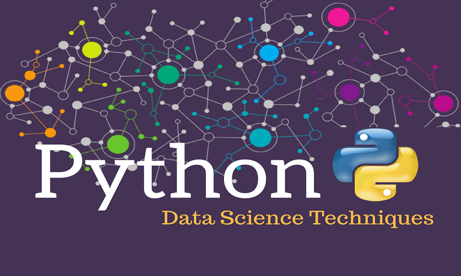

# Python for Data Science

This is a tutorial about Python for Data Science.

## What will you find here?

This repo is for Python for Data Science, so you will find Python toolkit tutorials here including Numpy, Scipy, Pandas, matplotlib, IPython, Jupyter notebook, etc.

## Requirements

Python v2.7 or v3.6 or higher
`pip` to install all tools or `easy_install`

You can install packages using:

`pip install <pkg>`

or

`easy_install <pkg>`

You can update packages using:

`pip install -U numpy==1.9.1` to version 1.9.1

or

`pip install -U numpy` to the latest version

or

`easy_install --upgrade numpy==1.9.1`

- We can also use Python distribution which includes various packages in-built. Anaconda, Enthought Canopy, PythonXY, WinPython, etc.

If you need a Python refresher, check out my other [Python repository](https://github.com/piyushpatel2005/Python)

### Table of Contents:

**Theory**

	[Problem Solving Approach to Data Science problems](lessons/Problem_solving_approach.ipynb)

	[Data Requirements and Collection](lessons/Data_collection.ipynb)

	[Data cleaning](lessons/Data_Cleaning.ipynb)

	[Data Modeling and Evaluation](lessons/Modeling.ipynb)

**[Unix basics](lessons/UNIX.html)**

**Python Notes**

	[Python Basics](lessons/Python101.ipynb)

	[String operations](lessons/python/1.2_String_Operations.ipynb)

	[Tuples](lessons/python/2.1_Tuples.ipynb)

	[Lists](lessons/python/2.2_Lists.ipynb)

	[Dictionaries](lessons/python/2.3_Dictionaries.ipynb)

	[Sets](lessons/python/2.4_Sets.ipynb)

	[Conditionals](lessons/python/3.1_Conditions.ipynb)

	[Loops](lessons/python/3.2_loops.ipynb)

	[Functions](lessons/python/3.3_Functions.ipynb)

	[Objects and Classes](lessons/python/3.4_Objects_and_Classes.ipynb)

	[Reading Files](lessons/python/4.1_Reading_Files.ipynb)

	[Writing Files](lessons/python/4.2Writing_and_Saving_Files.ipynb)

	[Loading and Viewing Data using Pandas](lessons/python/4.3_Loading_Data_and_Viewing_Data.ipynb)

**SQL**

	[Connecting to IBM DB2 in Jupyter](lessons/sql/1-1-Connecting-2-IBMDB2.ipynb)

	[Querying Database](lessons/sql/1-2-Querying.ipynb)

	[SQL Magic functions for SQL](lessons/sql/1-3-SQLmagic.ipynb)

	[Analyzunbg Data](lessons/sql/1-5-Analyzing-Data.ipynb)

	[Assignment](lessons/sql/1-6-Peer-Assignment.ipynb)

**Data Science Libraries**

	[NumPy 1D arrays](lessons/python/4.4_Numpy1d.ipynb)

	[NumPy 2D arrays](lessons/python/4.4_Numpy2d.ipynb)

	[Data Analysis intro using Pandas](lessons/python/001.Data_Analytis_Intro.ipynb)

	[Intro to Matplotlib](lessons/python/1-1-1.Introduction-to-Matplotlib.ipynb)

	[Area Plots, Histograms and Bar charts](lessons/python/2-2-1-Area-Plots-Histograms-and-Bar-Charts.ipynb)

	[Pie Charts, Scatter plots and Bubble Plots](lessons/python/2-3-1-Pie-Charts-Box-Plots-Scatter-Plots-and-Bubble-Plots.ipynb)

	[Waffle Charts, Word clouds and Regression Plots](lessons/python/3-4-1-Waffle-Charts-Word-Clouds-and-Regression-Plots.ipynb)

[Generating Maps](lessons/python/3-5-1-Generating-Maps.ipynb)

1. [NumPy Library](lessons/numpy.md)

	[Practical NumPy](lessons/numpy.ipynb)

	[NumPy Practicals 2](lessons/numpy2.ipynb)

	[NumPy Arrays](lessons/03_Numpy_Notebook.ipynb)

	[NumPy notebook](lessons/libs/03_Numpy_Notebook.ipynb)

	[Satellite Image Analysis](lessons/libs/Satellite_Image_Analysis_numpy.ipynb)

2. [Pandas Library](lessons/pandas.md)

	[Practical Pands](lessons/pandas.ipynb)

	[Pandas Practicals 2](lessons/pandas2.ipynb)

3. [Splunk](lessons/splunk.md)
