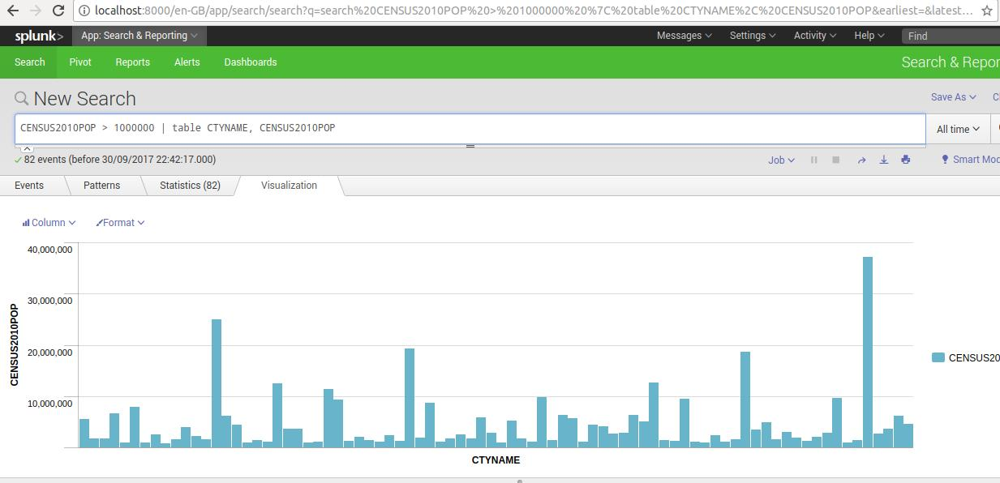

# Splunk

Splunk can be used to query a large data in a simple fashion. Install the splunk from [Official website](https://www.splunk.com/en_us/download/splunk-enterprise.html).

On Linux, download tarball and extract.

`cd splunk\bin`

`./splunk start`

Accept the license and use you will be given the url to open splunk interface on local machine.

You can login using the given credentials.

You will be asked to enter license file. You can use Free License with limited capabilities.

You can add Data and then go follow the steps. You can query data using `Search` option. This lesson is based on `census.csv` file in the `resources` folder.

Search terms looks like this.

`STNAME="California" CENSUS2010POP > 1000000 | table CTYNAME`

This searches for STNAME equal to California and which have CENSUS2010POP greater than 1000000. The result only displays CTYNAME field.

We can use logical operations

`STNAME="California" OR STNAME="Alaska"`

`|` is called pipe. It acts like a filter.

`CENSUS2010POP > 1000000 | sort CENSUS2010POP desc | table STNAME, CENSUS2010POP`

- We can also visualize the results using `Visualization` tab.

- We can use Splunk `Statistics` tab to perform statistrical operations.

`STNAME="California" | stats count`

`STNAME="California" | stats mean(CENSUS2010POP)`
